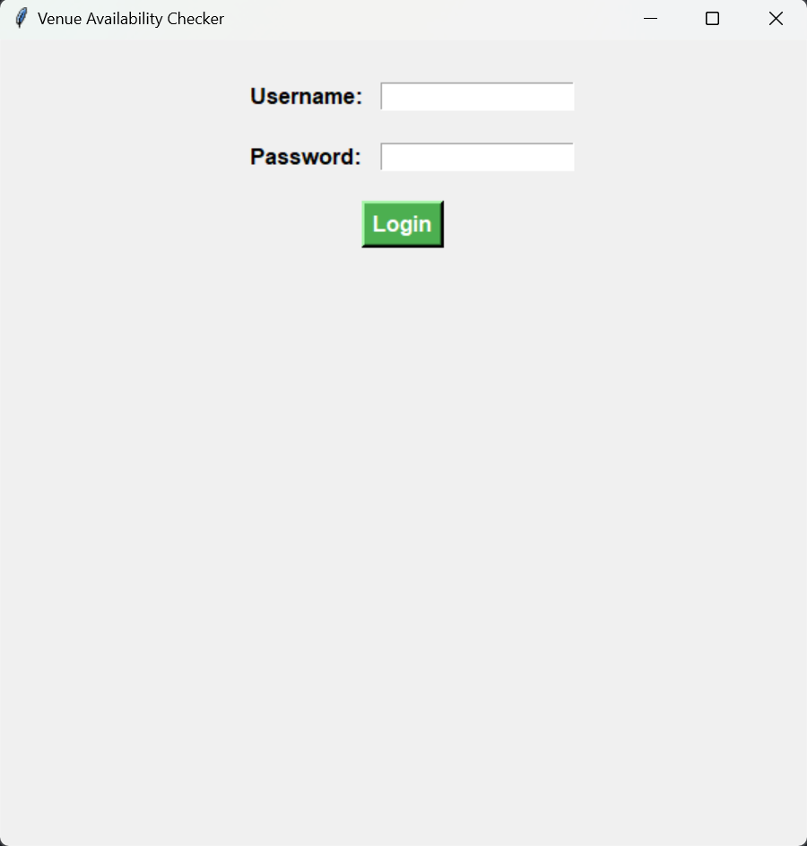
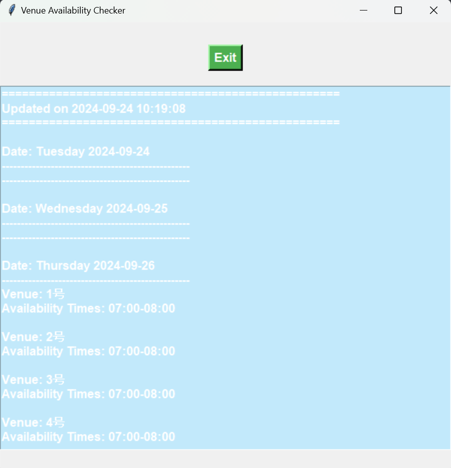

## BUAA_badminton_court_monitor 💕🥰💕

View it in [简体中文](简体中文.md)

>🫣🧐
>
>**Disclaimer:** —— Reference Repository
>https://github.com/NanmiCoder/MediaCrawler <br>
>
>Please use this repository for learning purposes only. For cases related to illegal web scraping, refer to: https://github.com/HiddenStrawberry/Crawler_Illegal_Cases_In_China <br>
>
>All the content of this repository is intended solely for learning and reference. It is strictly prohibited to use it for commercial purposes. No individual or organization is allowed to use the contents of this repository for illegal purposes or to infringe upon the legitimate rights of others. The web scraping techniques involved in this repository are only for learning and research purposes and must not be used for large-scale scraping of other platforms or for any other illegal activities. This repository does not assume any legal liability for any consequences arising from the use of its contents. By using the content of this repository, you agree to all the terms and conditions of this disclaimer.

>Click here for a more detailed disclaimer. [Click to view](#disclaimer) —— Reference Repository
https://github.com/NanmiCoder/MediaCrawler

### Description 😚

The primary function of this project is to monitor the available and bookable badminton courts at Beihang University's main badminton hall and display the specific information on the interface. The libraries used in this project include `playwright` (for web scraping automation) and `tkinter` (for interface display).

The interface is shown as follows: 😚





### Setup and Usage🥳
#### Environment Setup
This project uses the `python` programming language, and it's recommended to ensure that the `python` version is > 3.8. Then run the command:

```bash
pip install -r requirements.txt
```

Next, install the browser required by `playwright`:

```bash
playwright install chromium
```

#### Usage

Run the `main.py` file located in the `code` folder or use the command line to run:

```bash
python main.py
```

You will then need to enter your Beihang University unified authentication account and password on the login screen. After that, you'll enter the main interface. If the system detects any changes in the availability of bookable courts, the output will be refreshed.

### Disclaimer 🫢🤫🫢
<div id="disclaimer">

#### 1. Purpose and Nature of the Project
This project (hereinafter referred to as "the Project") was created as a tool for technical research and learning, aiming to explore and study web data collection techniques. The Project focuses on the research of data scraping techniques from social media platforms, and is intended to be a resource for learners and researchers for technical exchange purposes.

#### 2. Legal Compliance Statement
The developers of the Project (hereinafter referred to as "the Developers") remind users to strictly adhere to the relevant laws and regulations of the People's Republic of China when downloading, installing, and using the Project, including but not limited to the "Cybersecurity Law of the People's Republic of China", the "Counter-Espionage Law of the People's Republic of China", and any other applicable national laws and policies. Users are solely responsible for any legal liabilities that may arise from their use of the Project.

#### 3. Purpose Restriction
The Project is strictly prohibited from being used for any illegal purposes or for commercial activities that are not related to learning or research. The Project must not be used for any form of illegal intrusion into other computer systems, nor for any actions that infringe upon the intellectual property rights or other legitimate rights of others. Users must ensure that their use of the Project is solely for personal learning and technical research and not for any form of illegal activity.

#### 4. Disclaimer
The Developers have made every effort to ensure the legitimacy and safety of the Project but do not assume any responsibility for any direct or indirect losses that may result from the use of the Project. This includes, but is not limited to, any data loss, device damage, or legal disputes caused by the use of the Project.

#### 5. Intellectual Property Statement
The intellectual property rights of the Project belong to the Developers. The Project is protected by copyright laws, international copyright treaties, and other intellectual property laws and treaties. Users are permitted to download and use the Project provided that they comply with this statement and relevant laws and regulations.

#### 6. Right of Final Interpretation
The Developers reserve the right to the final interpretation of the Project. The Developers also reserve the right to modify or update this disclaimer at any time without prior notice.
</div>